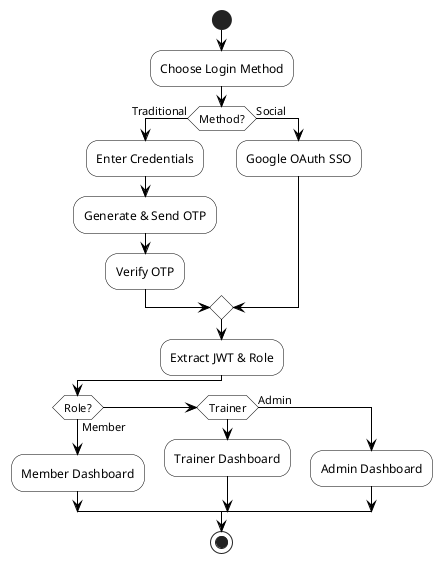

# Infosys Springboard Virtual Internship 6.0 Completion Report

**Team Details:** Team C  
**Batch Number:** 11  
**Start Date:** 29/12/2025  
**Names:** Mohana Varsha Sri Kandula, Aditya Bhushan Singh, Anushiya D  
**Internship Duration:** 8 Weeks  

---

## 1. Project Title
**Fitness Square - Smart Health and Fitness Companion**

## 2. Project Objective
To develop a full-stack health and fitness platform, **Fitness Square**, that enables users to track daily wellness activities—including workouts, nutrition, and recovery—while receiving logic-driven personalized health insights and connecting with certified trainers. The system utilizes structured goal tracking, performance analytics, and streak-based progress monitoring to promote sustainable fitness habits and professional trainer-client collaboration.

## 3. Project description in detail
Fitness Square is a full-stack health and fitness application built using **Spring Boot**, **MongoDB**, and **Vanilla JavaScript**. It helps users maintain consistent wellness habits through intelligent tracking and personalized guidance.

### **Technology Stack:**
- **Frontend:** HTML5, CSS3 (Modern Glassmorphism), JavaScript (ES6+), and Chart.js for visualization.
- **Backend:** Java Spring Boot, Spring Security with JWT and Google OAuth2 integration.
- **Database:** MongoDB for efficient document-based storage of activity logs and user profiles.

---

## **Core Features Implemented:**

### **1. Advanced Authentication & Security**
- **Multi-Channel Login:** Secure JWT-based traditional login and **Google Social Authentication** integration.
- **Verification Layer:** Implemented an **OTP (One-Time Password)** system for secure account verification and resend logic.
- **RBAC:** Robust Role-Based Access Control for Admin, Trainer, and Member profiles.

### **2. Health Intelligence & Analytics**
- **Medical Profile Integration:** Capability for users to upload and store medical records, which are used to tailor health recommendations.
- **Interactive Dashboards:** Dynamic **Chart.js** visualizations for tracking workout frequency, calorie trends, and health score growth.
- **Streak Monitoring:** A streak detection algorithm in the backend that tracks consecutive days of goal completion to boost user engagement.

### **3. Comprehensive Activity Tracking**
- **Holistic Loggers:** Detailed tracking for Workouts (type/duration), Meals (calories/macros), Hydration (liters), and Sleep (hours/quality).
- **Fast-Log Features:** Healthy Quick-Add meal suggestions to minimize manual data entry.

### **4. Integrated Fitness Calculator Suite**
- **Body Metrics:** Automated calculators for BMI (Body Mass Index) and BMR (Basal Metabolic Rate).
- **Specialized Lab:** Integrated tools for **Body Fat Percentage**, **Calorie Deficit** planning, and **Hydration Requirements** based on user activity levels.

### **5. Professional Collaboration Workflow**
- **Trainer Matching & Selection:** Interactive trainer discovery with specialization-based filtering and trainer ratings.
- **Change Management:** A formal **Trainer Change Request** system with Administrative oversight and notification status updates.
- **Digital Meetings:** Support for digital session scheduling with Zoom/Google Meet link integration.

### **6. Real-Time System Intelligence**
- **Unified Notification Hub:** Centralized bell-icon alert system for messages, approvals, and system updates.
- **Synchronization:** 15-second async polling for real-time trainer-client data parity.
- **Personalized Tips:** An intelligent feedback loop in the **HealthTipService** that cross-references daily logs to provide immediate, actionable wellness advice.

---

## 4. Timeline Overview

| Week | Phase / Project Goals | Implementation Steps & Outcomes |
| :--- | :--- | :--- |
| **Week 1** | System Foundation & Data Modeling. | Created JWT login security and MongoDB database structure. |
| **Week 2** | Role-Based Access & Secure Auth. | Set up Member/Trainer/Admin role redirection and 2-step OTP verification. |
| **Week 3** | Core Wellness Logging Suite. | Built core logging modules for Water, Sleep, Meals, and Workouts. |
| **Week 4** | Management Dashboards. | Created the Admin and Trainer dashboards for system oversight and client monitoring. |
| **Week 5** | Health Intelligence & Analysis. | Integrated BMI Calculator and the automated Health Tip engine. |
| **Week 6** | Advanced Data Visualization. | Created user-facing dashboards to visualize fitness trends using Chart.js. |
| **Week 7** | Dynamic Goal Analytics. | Compared user data with fitness goals; implemented percentage progress bars, color-coded alerts, and actionable insights. |
| **Week 8** | System Sync & Notification Hub. | Optimized 15s data syncing and finalized the main Notification Hub. |

---

## 5a. Key Milestones

| Milestone | Description | Date Achieved |
| :--- | :--- | :--- |
| **Project Kickoff** | Requirement gathering, research, and project layout for Fitness Square. | 29-12-2025 |
| **Prototype/First Draft** | Building the security system (JWT/OTP/Google Auth) and user roles. | 11-01-2026 |
| **Mid Term Review** | Implemented core modules: Activity Logs (Meal/Workout/Water/Sleep), BMI suite, and Dashboard systems. | 25-01-2026 |
| **Final Submission**| Combining trainer matching, notification alerts, and data charts. | 08-02-2026 |
| **Presentation** | Testing the system, fixing bugs, and finishing the project handover. | 14-02-2026 |

---

## 5b. Project execution details

### **Flowchart 1: Authentication & Security Workflow**

---

## 6. Snapshots / Screenshots
*(Place screenshots of the Fitness Square Dashboard, Analytics Trends, and the Notification Hub here)*

---

## 7. Challenges Faced

**Real-Time Data Synchronization (15s Polling):**
Ensuring that Trainers could see live updates of a Member's progress (like water intake or workout completion) without manual page refreshes was critical.
**Resolution:** Implemented a lightweight 15-second asynchronous polling mechanism in the frontend that fetches the latest MongoDB logs without disrupting the user’s current UI state.

**Complex State Management in Trainer Requests:**
The workflow for changing trainers involved three parties: the Member (requesting), the Admin (approving), and the Trainer (assigned). Managing these state transitions while keeping the UI in sync was a major hurdle.
**Resolution:** Engineered a dedicated `TrainerChangeRequest` entity and service layer in Spring Boot to handle status transitions (PENDING, APPROVED, REJECTED) and trigger unified notifications across roles.

**Chart.js Data Aggregation from MongoDB:**
Parsing varied Document structures from MongoDB into a consistent format for the weekly activity chart often led to "null pointer" errors during initialization.
**Resolution:** Developed a robust data-parsing utility in the backend that aggregates daily logs into weekly percentages, ensuring the Chart.js engine receives sanitized and structured data for accurate visualization.

**Google OAuth2 Security Integration:**
Merging Google’s social login with our existing custom JWT-based security system was difficult, as we had to ensure roles were assigned correctly for external users.
**Resolution:** Built a secure authentication filter that verifies Google tokens, maps emails to internal MongoDB profiles, and generates standard JWTs to keep the session management consistent.

**Goal Progress Variability & Feedback Logic:**
Calculating real-time progress against static targets (like weight loss or workout frequency) often required complex math that was difficult to display consistently across roles.
**Resolution:** Developed a dynamic Goal Analytics engine that compares current activity logs with user targets to generate percentage progress bars, color-coded status alerts (On-Track/Off-Track), and actionable health insights if the user falls behind.

**Trainer Matching Logic Implementation:**
Implementing an automated system to match members with certified trainers based on specific health goals and medical profiles was technically demanding.
**Resolution:** Developed a backend matching algorithm that filters trainers by their specializations (e.g., Weight Loss, Strength Training) and cross-references them with the member's current fitness targets and health score.

---

## 8. Learnings & Skills Acquired

**Technical Skills:**
- Developed and integrated **RESTful APIs** using Spring Boot backend technologies.
- Implemented **JWT-based authentication** and Role-Based Access Control (RBAC).
- Handled security configurations including **OTP verification** and CORS.
- Built interactive dashboards using **Vanilla JavaScript** and **Chart.js** for visualization.
- Designed and optimized **MongoDB** document structures for health tracking and analytics.
- Implemented algorithmic logic for **BMI/BMR calculations** and personalized health tips.

**Soft Skills:**
- **Problem Solving:** Successfully debugged complex CORS and asynchronous data rendering issues.
- **Effective Collaboration:** Worked in a specialized team (Frontend, Backend, Database) to deliver a unified product.
- **Time Management:** Adhered to a strict 8-week developmental timeline with milestone-based delivery.
- **Technical Documentation:** Created detailed flowcharts and project reports to document system architecture.

**Domain Knowledge:**
- **Health-Tech Intelligence:** Understanding of biometric calculations (BMI/BMR) and personalized health scoring.
- **FinTech-Grade Security:** Implementing secure authentication flows using JWT, Google OAuth, and OTP layers.
- **Ecosystem Management:** Designing workflows for Trainer-Client interaction and Administrative oversight.

**Tools & Technologies:**
- **Backend:** Java, Spring Boot, Spring Security, JWT.
- **Database:** MongoDB.
- **Frontend:** Vanilla JavaScript, HTML5, CSS3, Chart.js.
- **Others:** Git, Postman (for API testing), Draw.io (for architecture).

---

## 9. Team Testimonials

- **Mohana Varsha Sri Kandula:** "Successfully architected the Spring Boot backend, implementing secure JWT/OTP authentication and logic-driven services for personalized health tips."
- **Aditya Bhushan Singh:** "Designed the premium glassmorphism frontend and integrated Chart.js dashboards to provide an intuitive and interactive user experience."
- **Anushiya D:** "Engineered the MongoDB document schemas and optimized data persistence layers to handle large-scale wellness logs and user profiles efficiently."

"Working as a team on Fitness Square significantly improved our collaboration skills and gave us practical exposure to building a real-world full-stack health ecosystem."

---

## 10. Conclusion
The internship experience was highly enriching and professionally transformative. Working on the **Fitness Square** project allowed us to apply theoretical academic knowledge to practical, real-world scenarios. Through hands-on development of authentication systems, dashboards, analytics, and intelligent health modules, we strengthened our full-stack development skills and gained confidence in handling complex technical challenges in a professional environment.

---

## 11. Acknowledgements
We would like to express our sincere gratitude to **Infosys Springboard** and the entire Infosys team for providing us with the invaluable opportunity to be part of this internship program. Being associated with such a reputed organization has been a truly enriching and transformative experience. We are especially grateful to our mentor for their continuous guidance, support, and constructive feedback throughout the internship. Their mentorship greatly enhanced our technical and professional skills. We also appreciate our team members for creating a collaborative and encouraging environment that made this learning experience truly rewarding.
